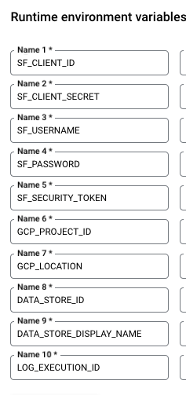

# Salesforce Knowledge Article Integration with Vertex AI Datastore

This project demonstrates how to integrate Salesforce Knowledge articles with Vertex AI Datastore, enhancing search capabilities for Salesforce Knowledge Articles. The integration is managed through a Google Cloud Function, scheduled to run daily using Cloud Scheduler.


## Project Overview

- **Google Cloud Function**: Fetches Salesforce Knowledge articles and uploads them to Vertex AI Datastore.
- **Cloud Scheduler**: Triggers the Cloud Function daily.
- **Salesforce Setup**: A custom field (`Text`) was added to the Knowledge object to store article content for searching.

## Prerequisites

### Google Cloud Setup

1. **Cloud Function**: Set up a Cloud Function with appropriate IAM roles for accessing Vertex AI Datastore.
2. **Cloud Scheduler**: Configure Cloud Scheduler to trigger the Cloud Function daily.

### Salesforce Setup

1. **Custom Field**: Create a custom field (`Text`) in the Knowledge object.
2. **Page Layout**: Update the page layout to include the `Text` field.
3. **API Credentials**: Follow the instructions below to generate the necessary Salesforce API credentials.

## Generating Salesforce API Credentials

1. **Update Salesforce Environment URLs**:
   - In the `config.py` file, update the following attributes to match your Salesforce environment URL:
     ```python
     self.sf_domain = "https://yourdomain-dev-ed.develop.my.salesforce.com"
     self.sf_article_base_url = "https://yourdomain-dev-ed.develop.lightning.force.com/lightning/r/Knowledge__kav/"
     ```

2. **Create a Dedicated Salesforce Account**:
   - Create a dedicated Salesforce account for the API integration. Ensure the user has access to the Knowledge object. For guidance, refer to the [Salesforce Admin Guide](https://help.salesforce.com/s/articleView?id=sf.fsc_admin_create_advisor_assign_perm.htm&type=5).

3. **Create a Connected App**:
   - Follow the instructions to create a Connected App and generate the credentials needed for API integrations with Salesforce. For details, see the [Salesforce Connected App Guide](https://help.salesforce.com/s/articleView?id=sf.connected_app_create.htm&type=5).

4. **Generate a Security Token**:
   - Obtain a security token by following the steps outlined in the [Salesforce Security Token Guide](https://help.salesforce.com/s/articleView?id=xcloud.user_security_token.htm&type=5).

5. **Credentials Required**:
   - After completing the above steps, you should have the following credentials:
     - `client_id`
     - `client_secret`
     - `username`
     - `password`
     - `security_token`

## Google Cloud Function Settings

Refer to the screenshots for Cloud Function setup. Key configuration options include:

- **Runtime**: Python 3.11
- **Trigger**: HTTP trigger
- **IAM Role**: Ensure the function has the required roles for accessing Vertex AI Datastore.




## Cloud Scheduler Settings

Cloud Scheduler is configured to run the function daily. See below for the Cloud Scheduler setup. Key configurations include:

- **Frequency**: Set to run daily.
- **Target**: The Cloud Function URL.


## Cloud Function Source Code

The source code for the Cloud Function is located in the `main.py` file. It includes logic to:

- Fetch Knowledge articles from Salesforce.
- Upload the article content to Vertex AI Datastore.

## Salesforce Setup

### Custom Field: "Text"

In Salesforce, a custom field named `Text` was added to the Knowledge object to store article content. See below for field details.


### Page Layout

The custom `Text` field was added to the Knowledge object page layout, as shown below.


## Running the Script

Once the Cloud Function and Cloud Scheduler are set up, the process runs automatically daily. The integration script fetches Salesforce Knowledge articles and uploads them to Vertex AI Datastore for advanced search functionality.

## Conclusion

This integration enhances the Salesforce search experience by leveraging Google Cloud's Vertex AI capabilities. Feel free to open issues or submit pull requests for any feature requests or bug fixes.
